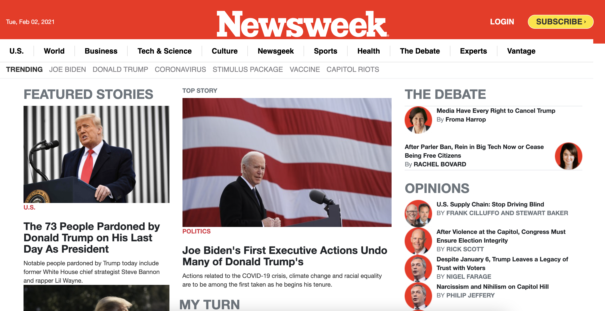
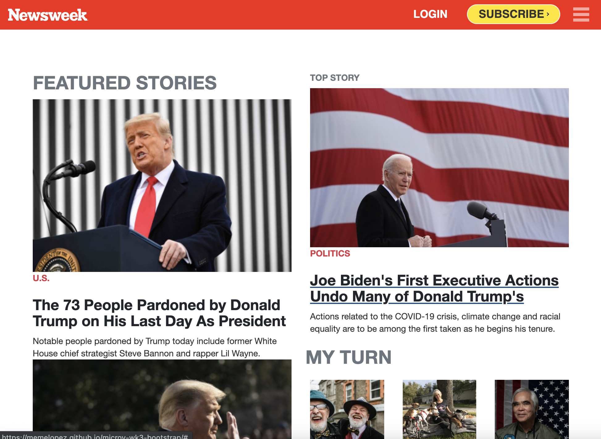

# HTML & CSS PROJECT 3 Newsweek-Bootstrap-clone

> Clone of THE NEWSWEEK page using Bootstrap

We applied botstrap all trough the project to achieve the desired lay out.

## Built With

- HTML & CSS
- Media queries
- Bootstrap

## Live Demo

[Live Demo Link](https://livedemo.com)

## Authors

👤 **Elmer Lopez**

- GitHub: [@memelopez](https://github.com/memelopez)
- Twitter: [@memelopez10](https://twitter.com/memelopez10)
- LinkedIn: [LinkedIn](https://www.linkedin.com/in/elmer-lopez-51b187200/)

👤 **Promise Johnson**

- GitHub: [promise-J](https://github.com/promise-J)
- Twitter: [@twitterhandle](https://twitter.com/Promise94353263)
- LinkedIn: [LinkedIn](https://www.linkedin.com/in/promise-chiemela-788887142)

## 🤝 Contributing

Contributions, issues, and feature requests are welcome!

## Show your support

Give a ⭐️ if you like this project!

## 📝 License

This project is [MIT](https://github.com/Diegodsha/Newsweek-Bootstrap/blob/Feature-1/LICENSE) licensed.
